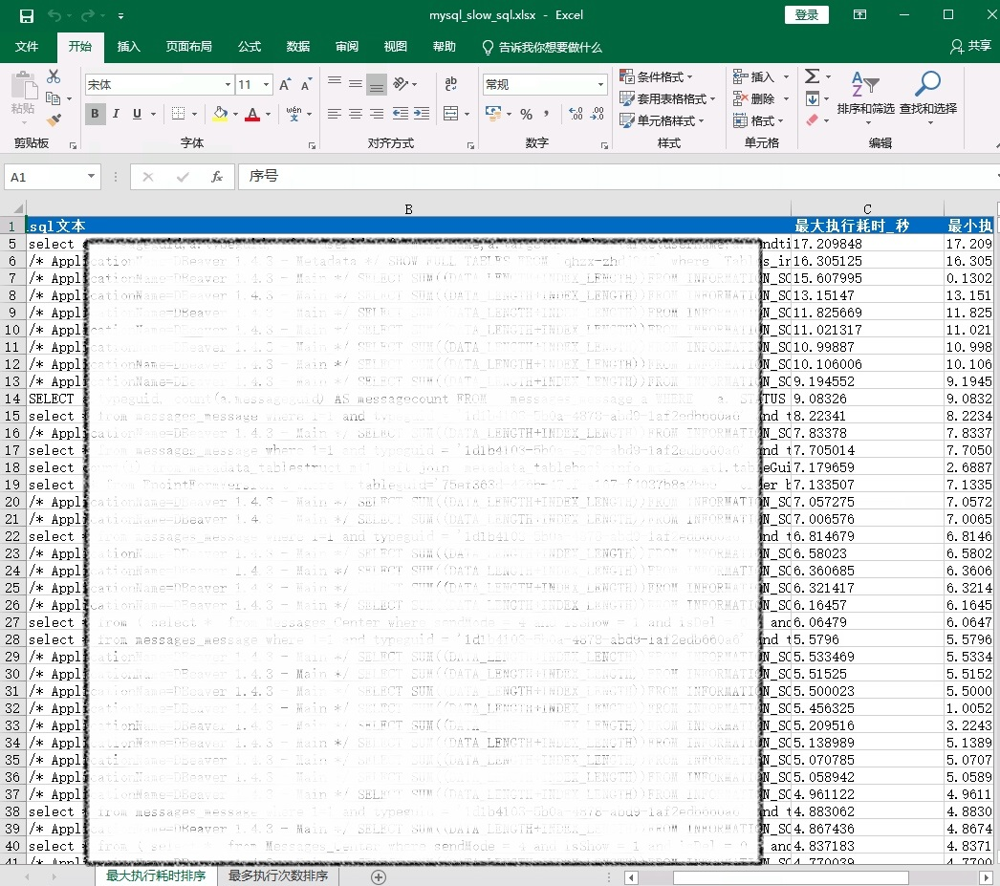
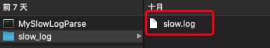

# MySQL慢日志解析工具

## 一、简介

通过正则解析MySQL慢日志文件，分析耗时的SQL以及分组汇总形成统计信息，生成慢查询报告

### 1.1 下载地址

https://github.com/iverycd/MysqlSlowLogAnalyze/releases

### 1.2 运行概览

- 慢查询汇聚以及TOP 20慢SQL


- 所有慢SQL执行情况



- SQL散点分布


## 二、使用
### Windows
1、解压压缩包到任意目录

2、将MySQL的慢日志放到slow_log目录


3、运行run.bat


### MacOS
1、解压压缩包到任意目录

2、将MySQL的慢日志放到slow_log目录



3、终端运行

```bash

./MySlowLogParse

```
## 三、查看报告

报告默认会在当前解压目录生成


